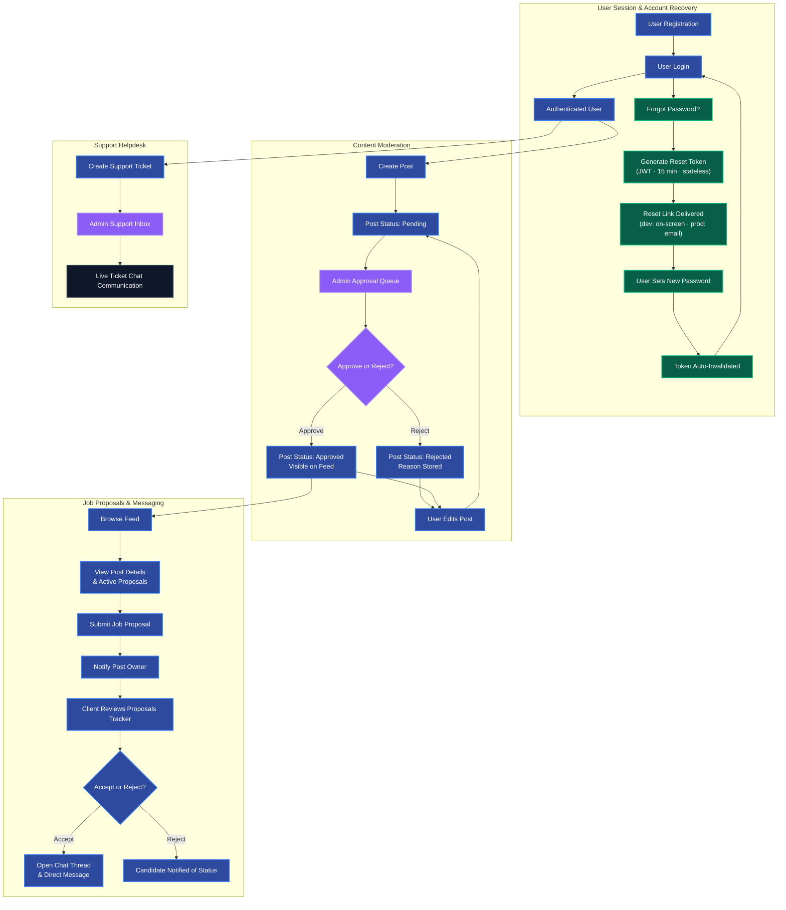

# FreelanceHub — Full-Stack Freelancer Social Platform

A modern full-stack social platform for freelancers with an **Instagram-style post feed**, admin moderation, role-based sessions, real-time notifications, a **forgot/reset password flow**, and a **premium dark/light theme**.

---

## Tech Stack

| Layer    | Technology                                          |
| -------- | --------------------------------------------------- |
| Frontend | React 18 · Tailwind CSS · Framer Motion             |
| Backend  | Node.js · Express.js                                |
| Database | **MySQL** (Sequelize ORM)                           |
| Auth     | JWT · bcryptjs (5h for users, no expiry for admins) |
| Images   | Cloudinary (or local disk fallback)                 |
| Charts   | Recharts                                            |
| State    | React Context API                                   |
| Routing  | React Router v6                                     |

> **Note:** This project runs on **MySQL** (via Sequelize), which is why it lives under `xampp/htdocs`. It uses XAMPP's MySQL on port `3306`. There is no MongoDB.

---

## Features

### User Panel

- Register · Login · Secure 5-hour auto-expiring session
- **Forgot Password / Reset Password**: Stateless JWT-based password reset flow — generates a secure 15-minute reset link without any DB schema changes. Token auto-invalidates after use.
- Create / Edit / Delete freelancer posts with image upload
- Instagram-style infinite-scroll feed with search & category filter
- Like & **inline comment** on approved posts (live)
- **Real-time notification bell** in the header (likes, comments, approvals) with unread badge
- Real-time dashboard: stats + last-7-days engagement chart (live from DB)
- Profile management: **photo upload**, bio, skills, "member since", and **change password**
- Post status filter tabs (All / Approved / Pending / Rejected)
- Activity / session history
- **Interactive Chat / Direct Messaging**: Thread-based message lists with auto-refreshing conversation panes.
- **Job Proposals**: Apply to client postings with custom cover letters and bid rates, and monitor application status.
- **Support Helpdesk**: Submit tickets and message support administrators directly.
- **Single Post Detail View**: View job specs, user details, and apply via `/post/:id` routing.
- **Local Network Testing**: Helper to rewrite loopback URLs for mobile browser testing over local Wi-Fi.

### Admin Panel

- Dashboard with live stats and charts
- Post approval workflow (Approve / Reject with reason)
- User management (Block / Unblock with reason)
- Activity logs (login time, logout time, IP, device, session status)
- CSV export of logs
- Admin-only protected routes
- **No session auto-logout for admins** (admins stay logged in until they sign out)
- **Support Inbox**: Manage, review, and reply to user support desk tickets.
- **Responsive Mobile Header**: On mobile, the admin header shows hamburger menu (top-left), brand logo (top-center), and theme toggle + notification bell + profile icon (top-right).

### Theme

- **Dark mode** (default): Navy `#0a0f1e` · Charcoal · Neon Blue `#3b82f6` · Purple `#8b5cf6`
- **Light mode**: Soft slate `#f0f4ff` · White cards · Vibrant accents
- Toggle persisted to `localStorage` — click ☀/🌙 in the sidebar

---

## Platform Workflows

### 1. Job Posting & Content Moderation

1. **Creation**: A freelancer designs and publishes a job post containing a title, description, budget range, skill requirements, and a cover image.
2. **Pending Queue**: Upon creation, the post's status is set to `Pending` and is kept hidden from the public feed.
3. **Admin Moderation**: An administrator reviews the post from the Admin Control Panel. They can either **Approve** it (making it public) or **Reject** it (supplying an edit reason).
4. **Re-Submission**: If the freelancer modifies the details of an approved or rejected post, the post automatically reverts back to `Pending` status and is re-moderated.

### 2. Proposal Submission & Job Matching

1. **Browsing**: Freelancers browse approved posts on the Feed using keyword searches or category filtering.
2. **Detailed View**: The freelancer opens a post (`/post/:id`) to inspect all job parameters, active proposal counts, and client details.
3. **Application**: The freelancer fills out a proposal form, specifying their bid rate and pitching their experience in a cover letter.
4. **Review & Action**: The client receives a real-time notification, accesses their Proposals Tracker, and accepts or rejects the candidate.

### 3. Collaboration & Direct Messaging

1. **Initiation**: A user opens a chat screen directly from a freelancer's proposal card or profile view.
2. **Active Chat**: A conversation thread is initialized under the Chat module, allowing the user and freelancer to communicate in real-time.
3. **Responsive Display**: On mobile screens, the chat workspace adapts into a single-pane display, using a custom Back (←) button to return to the active thread list.

### 4. Support Desk Ticketing

1. **Ticket Submission**: Users experiencing technical issues submit a support request ticket outlining their issue.
2. **Queue & Status**: The request joins the admin Support Inbox queue. Admin updates the ticket status (`Open`, `In Progress`, or `Resolved`).
3. **Support Chat**: Admin and users exchange messages directly within the ticket detail screen to solve queries.

### 5. Forgot Password & Account Recovery

1. **Request**: The user clicks "Forgot password?" on the login page and submits their email address.
2. **Token Generation**: The server generates a short-lived JWT (15 minutes) signed with `JWT_SECRET + user.password_hash` and returns the reset URL in the API response (shown on-screen for development environments — replaceable with SMTP in production).
3. **Reset**: The user navigates to `/reset-password?token=...&id=...`, enters a new password, and submits the form.
4. **Validation**: The server verifies the token against the user's current password hash, hashes and saves the new password. The token is automatically invalidated after the first successful use (since the hash changes).
5. **Login**: The user is redirected to the login page and can sign in with the new password.

> **Security design**: No database columns are added — the token is stateless. Replaying an already-used token returns `400 Invalid or expired reset token.`

### 6. Platform Workflows Flowchart



---

## Project Structure

```
freelancehub/
├── database/
│   └── freehub.sql             # Generated MySQL schema + seed (import into MySQL Workbench)
├── backend/
│   ├── config/
│   │   ├── database.js         # MySQL + Sequelize connection (auto-creates the DB)
│   │   ├── cloudinary.js       # Cloudinary + multer upload (local /uploads fallback)
│   │   └── seed.js             # Admin user seeder
│   ├── controllers/
│   │   ├── authController.js   # Register, Login, Logout, Profile (+ avatar), Change password
│   │   ├── postController.js   # CRUD, Like, Comment, Feed, my-stats
│   │   └── adminController.js  # Dashboard, Approvals, Users
│   ├── middleware/
│   │   └── authMiddleware.js   # JWT verify + session check + admin guard
│   ├── models/
│   │   ├── User.js             # Sequelize User model (bcrypt hashing)
│   │   ├── Post.js             # Posts with approval workflow
│   │   ├── Activity.js         # LoginLog, Like, Comment, BlockedUser
│   │   └── index.js            # Model associations
│   ├── routes/                 # authRoutes, postRoutes, adminRoutes, userRoutes, logRoutes
│   ├── utils/
│   │   └── dbUtils.js          # normalize() — Sequelize → API response shaper
│   ├── scripts/
│   │   └── export-sql.js       # Regenerates database/freehub.sql from the models
│   ├── uploads/                # Local image storage (auto-created)
│   ├── server.js               # Express app entry point
│   ├── .env                    # Environment variables (edit this!)
│   └── package.json
│
└── frontend/
    ├── public/index.html
    ├── src/
    │   ├── components/
    │   │   ├── common/
    │   │   │   ├── UI.jsx           # PageHeader, StatCard, Button, Input, Modal, Table…
    │   │   │   └── Logo.jsx         # Redesigned branding logo
    │   │   ├── layout/
    │   │   │   ├── UserLayout.jsx   # User sidebar + routing shell + responsive bottom navigation
    │   │   │   └── AdminLayout.jsx  # Admin sidebar + routing shell
    │   │   └── user/
    │   │       ├── PostCard.jsx        # Feed card with like + inline comments
    │   │       ├── NotificationBell.jsx# Header bell with unread badge (polls live)
    │   │       └── SessionBar.jsx      # Session countdown bar (users only)
    │   ├── context/
    │   │   ├── AuthContext.jsx  # JWT storage, role-based auto-logout, axios interceptors
    │   │   └── ThemeContext.jsx # Dark/light toggle with persistence
    │   ├── pages/
    │   │   ├── auth/            # Landing, Login, Register, ForgotPassword, ResetPassword
    │   │   ├── user/            # Dashboard, Feed, CreatePost, Profile, Notifications, EditPost, PostDetail, Chat, Proposals, SupportDesk, Bookmarks, Settings
    │   │   └── admin/           # AdminDashboard, AdminPosts, AdminUsers, ActivityLogs, SupportInbox
    │   ├── utils/api.js         # Axios API wrappers with local network asset utility
    │   ├── styles/index.css     # CSS variables, dark/light, animations, responsive design styles
    │   ├── App.jsx              # Route definitions + protected routes
    │   └── index.js
    ├── tailwind.config.js
    ├── postcss.config.js
    └── package.json
```

---

## Installation & Setup

### Prerequisites

- **Node.js** 16+
- **MySQL** running (e.g. start **MySQL** from the XAMPP Control Panel — port `3306`)

### 1. Install dependencies

```bash
# Backend
cd freelancehub/backend
npm install

# Frontend
cd ../frontend
npm install
```

### 2. Configure environment variables

Edit `backend/.env`:

```env
PORT=5001
JWT_SECRET=change_this_to_a_long_random_secret
JWT_EXPIRES_IN=5h
SESSION_TIMEOUT_HOURS=5

# Cloudinary (optional — falls back to local disk if not set)
CLOUDINARY_CLOUD_NAME=your_cloud_name
CLOUDINARY_API_KEY=your_api_key
CLOUDINARY_API_SECRET=your_api_secret

# Admin account (auto-created on first run)
ADMIN_EMAIL=admin@freelancehub.com
ADMIN_PASSWORD=Admin@123456

NODE_ENV=development
CLIENT_URL=http://localhost:3000

# MySQL (XAMPP)
DB_HOST=localhost
DB_PORT=3306
DB_USER=root
DB_PASSWORD=          # set your MySQL root password here
DB_NAME=freehub
```

> The `freehub` database and all tables are **created automatically** on first run (`sequelize.sync()`), and the admin account is seeded. No manual SQL needed.
> Prefer to set up the DB in MySQL Workbench instead? Import `database/freehub.sql`.

### 3. Run the app

```bash
# Terminal 1 — Backend (http://localhost:5001)
cd backend
npm run dev          # uses nodemon

# Terminal 2 — Frontend (http://localhost:3000)
cd frontend
npm start
```

> **Windows note:** use `npm run dev` for the backend. The `npm start` script uses Unix-style `PORT=5001 node server.js`, which does not work in PowerShell.

### 4. Login

| Role  | Email                  | Password     |
| ----- | ---------------------- | ------------ |
| Admin | admin@freelancehub.com | Admin@123456 |
| User  | Register a new account | Any 8+ chars |

---

## API Endpoints

### Auth

| Method | Route                      | Auth   | Description                                           |
| ------ | -------------------------- | ------ | ----------------------------------------------------- |
| POST   | /api/auth/register         | Public | Create account                                        |
| POST   | /api/auth/login            | Public | Login + create session                                |
| POST   | /api/auth/logout           | User   | End session                                           |
| GET    | /api/auth/me               | User   | Get profile                                           |
| PUT    | /api/auth/update-profile   | User   | Update profile (+ avatar upload)                      |
| PUT    | /api/auth/change-password  | User   | Change password                                       |
| POST   | /api/auth/forgot-password  | Public | Generate stateless 15-min password reset link         |
| POST   | /api/auth/reset-password   | Public | Validate reset token and save new password            |

### Posts

| Method | Route                   | Auth     | Description                        |
| ------ | ----------------------- | -------- | ---------------------------------- |
| GET    | /api/posts              | Optional | Public feed (approved only)        |
| POST   | /api/posts              | User     | Create post (pending)              |
| GET    | /api/posts/my-posts     | User     | Own posts                          |
| GET    | /api/posts/my-stats     | User     | Dashboard stats + 7-day engagement |
| GET    | /api/posts/:id          | Optional | Single post + comments             |
| PUT    | /api/posts/:id          | User     | Edit post (re-pends approval)      |
| DELETE | /api/posts/:id          | User     | Delete own post                    |
| POST   | /api/posts/:id/like     | User     | Toggle like                        |
| POST   | /api/posts/:id/comment  | User     | Add comment                        |
| GET    | /api/posts/:id/comments | Public   | Get comments                       |

### Bookmarks

| Method | Route                  | Auth | Description                 |
| ------ | ---------------------- | ---- | --------------------------- |
| POST   | /api/bookmarks/:postId | User | Toggle post bookmark status |
| GET    | /api/bookmarks         | User | List all bookmarked posts   |

### Proposals

| Method | Route                        | Auth | Description                  |
| ------ | ---------------------------- | ---- | ---------------------------- |
| POST   | /api/proposals/apply/:postId | User | Apply for a job post         |
| GET    | /api/proposals/post/:postId  | User | Get all proposals for a post |
| GET    | /api/proposals/my            | User | Get own submitted proposals  |
| PUT    | /api/proposals/:id/status    | User | Update proposal status       |

### Messages & Chat

| Method | Route                            | Auth | Description                   |
| ------ | -------------------------------- | ---- | ----------------------------- |
| POST   | /api/messages                    | User | Send a chat message           |
| GET    | /api/messages/conversations      | User | Get user's conversation list  |
| GET    | /api/messages/history/:partnerId | User | Get message history with user |

### Support Helpdesk

| Method | Route                                   | Auth  | Description                  |
| ------ | --------------------------------------- | ----- | ---------------------------- |
| POST   | /api/support/tickets                    | User  | Create support ticket        |
| GET    | /api/support/tickets                    | User  | Get own tickets              |
| GET    | /api/support/tickets/:id                | User  | Get support ticket details   |
| POST   | /api/support/tickets/:id/messages       | User  | Add message to ticket        |
| GET    | /api/support/admin/tickets              | Admin | Admin: Get all tickets       |
| GET    | /api/support/admin/tickets/:id          | Admin | Admin: Get ticket details    |
| POST   | /api/support/admin/tickets/:id/messages | Admin | Admin: Add message to ticket |
| PUT    | /api/support/admin/tickets/:id/status   | Admin | Admin: Update ticket status  |

### Users

| Method | Route                    | Auth | Description                                        |
| ------ | ------------------------ | ---- | -------------------------------------------------- |
| GET    | /api/users/notifications | User | Real-time notifications (likes/comments/approvals) |
| GET    | /api/users/:id           | User | Get a user                                         |

### Admin

| Method | Route                        | Auth  | Description            |
| ------ | ---------------------------- | ----- | ---------------------- |
| GET    | /api/admin/dashboard         | Admin | Stats + recent data    |
| GET    | /api/admin/posts             | Admin | All posts (filterable) |
| PUT    | /api/admin/posts/:id/approve | Admin | Approve post           |
| PUT    | /api/admin/posts/:id/reject  | Admin | Reject with reason     |
| DELETE | /api/admin/posts/:id         | Admin | Delete post            |
| GET    | /api/admin/users             | Admin | All users              |
| PUT    | /api/admin/users/:id/block   | Admin | Block user             |
| PUT    | /api/admin/users/:id/unblock | Admin | Unblock user           |

### Logs

| Method | Route                 | Auth  | Description           |
| ------ | --------------------- | ----- | --------------------- |
| GET    | /api/logs             | Admin | All login/logout logs |
| GET    | /api/logs/my-sessions | User  | Own session history   |

### Uploads

| Route                  | Description                                 |
| ---------------------- | ------------------------------------------- |
| GET /uploads/:filename | Locally-stored images (Cloudinary fallback) |

---

## Security Features

- ✅ JWT tokens — **5-hour expiry for users**, **no expiry for admins**
- ✅ Session records in DB — invalidated on logout or block
- ✅ bcryptjs password hashing (salt rounds: 12)
- ✅ Rate limiting (100 req/15min general; stricter on auth)
- ✅ Helmet.js security headers (with cross-origin policy for `/uploads`)
- ✅ XSS-Clean middleware
- ✅ Role-based route guards (user / admin)
- ✅ Blocked user session termination
- ✅ Axios 401 interceptor for auto-logout on expired tokens
- ✅ **Stateless password reset tokens** — signed with `JWT_SECRET + user.password_hash`; auto-invalidate after first use and on any password change (no DB columns required)

---

## Theme Switching

Click the **☀/🌙 icon** in the sidebar. The choice is saved to `localStorage` and applied instantly across all pages via CSS custom properties (`var(--bg-primary)`, `var(--neon)`, etc.).

---

## Database

- **Engine:** MySQL via Sequelize ORM. Tables: `users`, `posts`, `login_logs`, `likes`, `comments`, `blocked_users`.
- **Auto-setup:** on first run the `freehub` database, all tables, and the admin user are created automatically.
- **Schema file:** `database/freehub.sql` — import into MySQL Workbench to inspect or recreate the schema.
- **Regenerate the `.sql`:** `cd backend && node scripts/export-sql.js`

---

## Production Build

```bash
cd frontend
npm run build
# Serve the build/ folder from Express or a CDN
```

### Cloudinary (Optional)

1. Create a free account at cloudinary.com
2. Copy Cloud Name, API Key, API Secret into `backend/.env`
3. Images are auto-optimized and stored in `freelancehub/posts/`
4. Without Cloudinary configured, images save to `backend/uploads/` and are served from `/uploads`

---

_Designed and Developed by CloudHawk_
